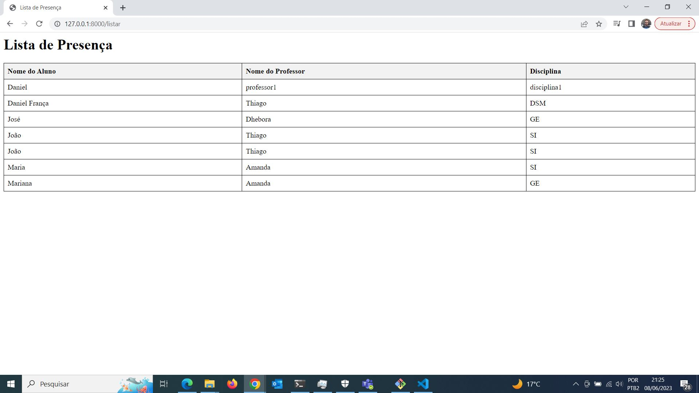

# Projeto Avaliação DESENVOLVIMENTO WEB III

## Entrega

A entrega estará na Master não foi dado enfaze ao frontend apenas aos processo do Django

Temos duas rotas a / (root)

Onde cada um pode se cadastrar conforme imagem abaixo:

Temos uma segunda rota /listar

Essa rota listar todos os alunos que cadastraram suas presenças:

### Obs: não foi colocado nenhum botão ou link levando para a página listar, pois teoricamente ela deveria ser mostrada apenas aos professores, caso no final do semestre "sobre" tempo estarei criando uma branch de melhorias nesse projeto.
